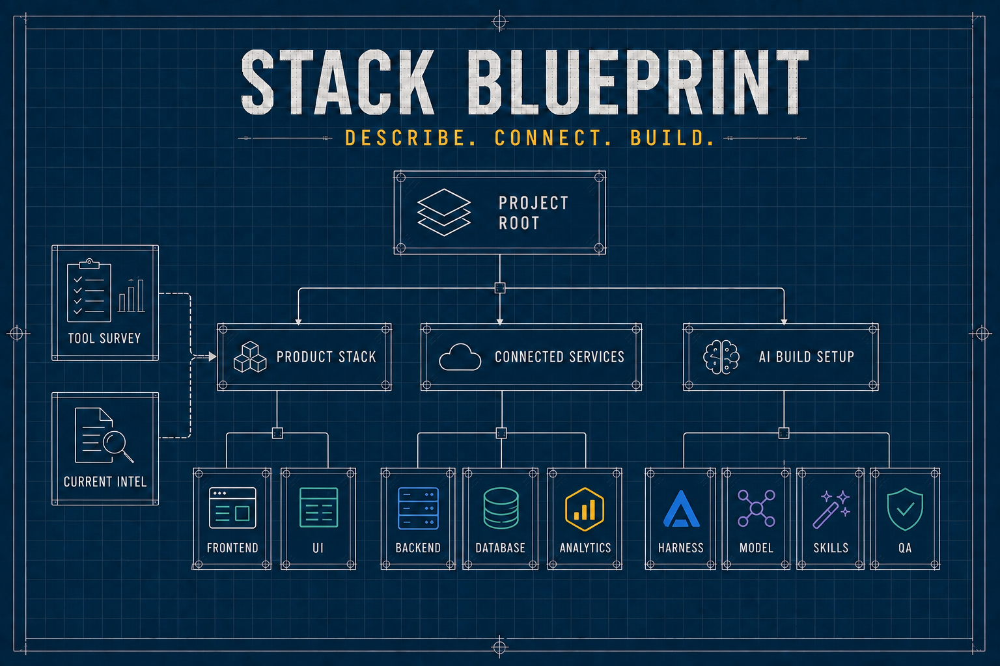

# Stack Blueprint



An open-source WebMCP consultant for the first decision of any software project: **what should we build it with, what AI tools should help us build it, and why?**

A builder describes an idea in ordinary language. The WebMCP architect infers the project profile, searches VibeLeaderboard’s maintained public catalog for related products and execution tools, gathers a cited Intel packet, and drafts a specific build system. A familiar product stack may still be the right answer; the extra value is matching every major product choice to the AI tools that make it easier to execute—for example Supabase MCP for Supabase, React Doctor for React, and Sentry MCP for Sentry—plus harness, model, design, anti-slop polish, verification, and release gates.

## What it selects

The internal consultation covers:

- **Foundation:** system shape, interface, runtime, data, AI strategy, integrations, engineering workflow, and delivery
- **Product services:** styling/UI, ORM/data layer, identity, storage, search, CMS, transactional email, payments, product analytics, web analytics, monitoring/security, and CI/CD
- **AI building toolkit:** coding agent, builder-model strategy, research/Intel, AI design assistance, repository skills/instructions, MCP and connected tools, and independent review/QA

The overview shows only the answer: exact products, frameworks, services, coding harness, builder model, repository skills, CI, research, and verification tools. It omits unnecessary services automatically. Rationale stays behind each logo so the initial result remains easy to scan; it does not present an alternative-choice grid unless a user explicitly asks for one.

## WebMCP collaboration

The page registers six visible tools:

- `build_project_blueprint` — infer the profile, consult related products, execution tools, and Intel, then draft every decision from one project description
- `inspect_project_blueprint` — inspect the complete exact stack or one selected pick
- `refine_project_blueprint` — replace the first draft after the agent reasons over constraints, Intel, and related catalog evidence
- `survey_stack_tools` — find maintained candidates in the public tool catalog
- `consult_stack_intel` — retrieve current, citable engineering evidence
- `render_project_blueprint` — produce the final software and AI build plan

The same automatic build and click-to-explain flow remains usable manually in browsers without WebMCP.

## Why the WebMCP matters

A plain agent may choose the same sensible framework and backend. Stack Blueprint turns those choices into an empowered agent workspace: selected products automatically trigger their companion MCPs, diagnostics, implementation skills, hardening, verification, and release gates. It also returns current execution-tool candidates, related VibeLeaderboard entries, and citable Intel. The initial stack remains a hypothesis: a similar app is not proof, and the calling agent must assess whether each observed pattern or tool actually improves this project.

## Public evidence boundary

Stack Blueprint uses a narrow same-origin proxy for VibeLeaderboard’s public, read-only catalog and Intel tools. It uses no API key, authentication cookie, Supabase credential, transcript, article body, or private VibeLeaderboard source code. Returned content is treated as untrusted plain text and is never rendered as HTML.

The upstream endpoint can be changed server-side with `VIBELEADERBOARD_MCP_URL`; the default is the public production MCP endpoint. The browser talks only to `/api/vibe`.

## Run and verify

```bash
npm install
npm run dev
npm test
npm run typecheck
npm run build
```

The visual and interaction contract is documented in [`DESIGN.md`](./DESIGN.md).

## License

MIT. See [`LICENSE`](./LICENSE).
