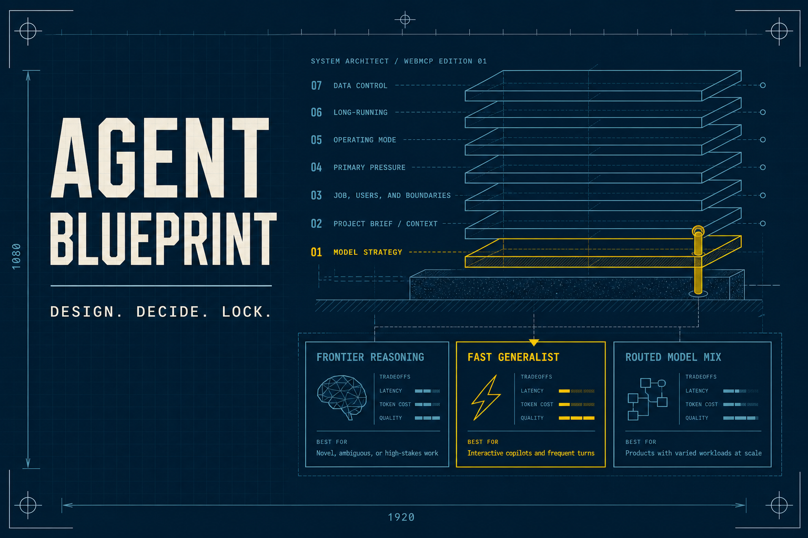

# Agent Blueprint



An open-source WebMCP workspace where a builder and browser agent design an agent stack together. The architecture is revealed one layer at a time; every option teaches its best use and tradeoff, and only an explicit human-approved lock advances the drawing.

The seven layers cover:

1. Model strategy
2. Agent runtime
3. Tools and protocols
4. Skills and procedures
5. Context and memory
6. Evaluations and observability
7. Execution boundary

## WebMCP collaboration

The page registers six visible tools:

- `begin_agent_blueprint` — start the shared drawing from a project brief
- `inspect_blueprint_options` — read the available choices and tradeoffs
- `search_blueprint_sources` — search public tools or Intel evidence
- `recommend_blueprint_option` — place an agent recommendation without committing it
- `lock_blueprint_choice` — lock a decision only after the user approves it
- `render_agent_blueprint` — produce the final implementation build sheet

The same workflow remains usable manually in browsers without WebMCP.

## Public evidence boundary

Agent Blueprint uses a narrow same-origin proxy for VibeLeaderboard’s public, read-only catalog and Intel tools. It uses no API key, authentication cookie, Supabase credential, transcript, article body, or private VibeLeaderboard source code. Returned content is treated as untrusted plain text and is never rendered as HTML.

The upstream endpoint can be changed server-side with `VIBELEADERBOARD_MCP_URL`; the default is the public production MCP endpoint. The browser talks only to `/api/vibe`.

## Run locally

```bash
npm install
npm run dev
```

Open the local URL shown by Next.js. In a WebMCP-capable browser, the status changes to **Agent connected**.

## Verify

```bash
npm test
npm run typecheck
npm run build
```

The visual and interaction contract is documented in [`DESIGN.md`](./DESIGN.md).

## License

MIT. See [`LICENSE`](./LICENSE).
